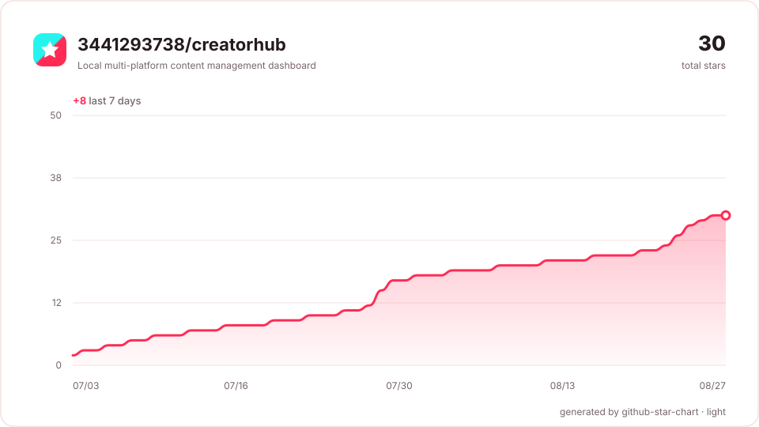
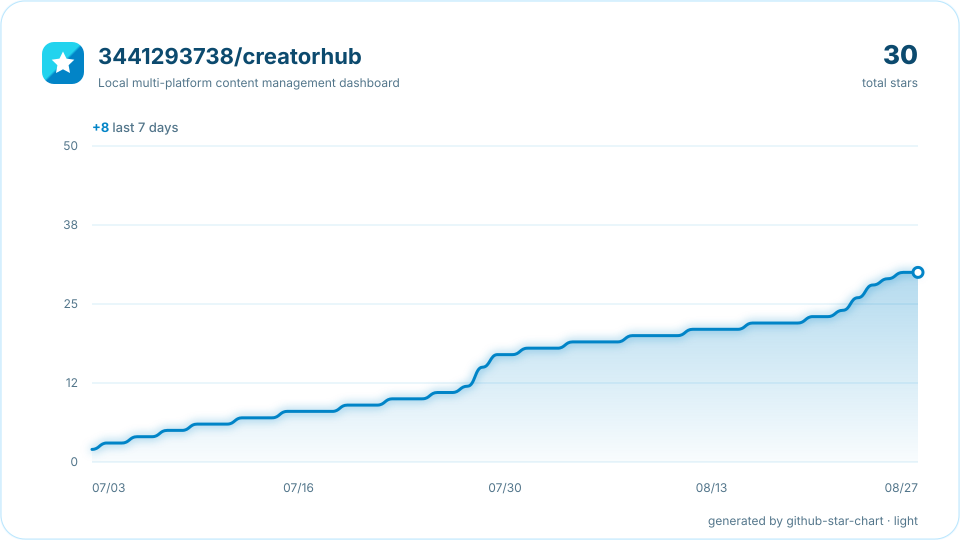

# GitHub Star Chart

> 在仓库自己的 GitHub Actions 中生成可定制的 Star 历史 SVG。无需把个人 PAT 写进 README，也不把令牌交给第三方图表服务。

## 特性

- 使用工作流内置的临时 `GITHUB_TOKEN`
- 自动生成亮色、暗色两份 SVG
- 默认发布到独立的 `star-history` 数据分支
- 纯 Python 标准库，无运行时依赖
- 支持动画，并遵守 `prefers-reduced-motion`
- 支持项目品牌色、不同卡片结构及折线效果
- Action 运行结束后令牌自动失效，生成的 SVG 不包含令牌

## 内置视觉主题

### CreatorHub Card



### Ocean Neon



| 主题 | 说明 | 主色 |
|---|---|---|
| `creatorhub` | CreatorHub 深色面板风格 | 抖音红 + 青色点缀 |
| `github` | GitHub 原生视觉 | GitHub 蓝 |
| `ocean` | 清爽科技感 | 天蓝 + 青色 |
| `sunset` | 暖色渐变 | 橙色 + 粉色 |
| `forest` | 自然、稳重 | 绿色 + 青柠 |
| `lavender` | 柔和创意感 | 紫色 + 洋红 |
| `mono` | 极简黑白 | 中性色 |

## 卡片样式

| 样式 | 效果 |
|---|---|
| `card` | 完整信息卡、总 Star、7 日增长、面积图 |
| `minimal` | 更少边框和装饰，适合紧凑 README |
| `glass` | 半透明卡片感和更大圆角 |
| `neon` | 带发光滤镜的霓虹折线 |

折线还可以选择：`smooth`、`straight`、`step`。

## 快速接入

在目标仓库创建 `.github/workflows/star-chart.yml`：

```yaml
name: Update Star Chart

on:
  schedule:
    - cron: "0 */6 * * *"
  watch:
    types: [started]
  workflow_dispatch: {}

permissions:
  contents: write

concurrency:
  group: star-chart
  cancel-in-progress: true

jobs:
  chart:
    runs-on: ubuntu-latest
    steps:
      - uses: actions/checkout@v7
      - uses: 3441293738/github-star-chart@v1
        with:
          theme: creatorhub
          style: card
          curve: smooth
          branch: star-history
```

然后在目标仓库 README 中加入：

```html
<picture>
  <source media="(prefers-color-scheme: dark)"
          srcset="https://raw.githubusercontent.com/OWNER/REPO/star-history/assets/star-history-dark.svg">
  
</picture>
```

将 `OWNER/REPO` 替换为实际仓库，例如 `3441293738/creatorhub`。

## 自定义示例

### CreatorHub 品牌风格

```yaml
- uses: 3441293738/github-star-chart@v1
  with:
    theme: creatorhub
    style: card
    curve: smooth
    show-points: "false"
```

### 霓虹科技风

```yaml
- uses: 3441293738/github-star-chart@v1
  with:
    theme: ocean
    style: neon
    curve: smooth
    show-points: "true"
```

### 完全自定义品牌色

```yaml
- uses: 3441293738/github-star-chart@v1
  with:
    theme: github
    style: glass
    accent: "#ff2442"
    accent-2: "#25f4ee"
    title: "My Open Source Journey"
```

## Action 输入

| 参数 | 默认值 | 说明 |
|---|---|---|
| `repo` | 当前仓库 | `OWNER/NAME` |
| `token` | `github.token` | 只在 Runner 内使用 |
| `theme` | `creatorhub` | 视觉主题 |
| `style` | `card` | 卡片结构 |
| `curve` | `smooth` | 曲线形态 |
| `accent` | 空 | 覆盖主色 |
| `accent-2` | 空 | 覆盖辅助色 |
| `title` | 仓库名 | 自定义标题 |
| `width` | `960` | SVG 宽度，至少 560 |
| `height` | `540` | SVG 高度，至少 340 |
| `show-points` | `false` | 显示采样点 |
| `show-growth` | `true` | 显示近 7 日增长 |
| `animate` | `true` | 首次展示时绘制曲线动画 |
| `branch` | `star-history` | 图表数据分支 |
| `output-dir` | `assets` | 数据分支内目录 |

## 本地开发

无需安装第三方依赖：

```bash
set PYTHONPATH=src
python -m unittest discover -s tests -v
python -m star_chart.cli ^
  --fixture tests/fixtures/creatorhub.json ^
  --output-dir examples/generated ^
  --theme creatorhub ^
  --style card
```

macOS / Linux：

```bash
PYTHONPATH=src python3 -m unittest discover -s tests -v
PYTHONPATH=src python3 -m star_chart.cli \
  --fixture tests/fixtures/creatorhub.json \
  --output-dir examples/generated \
  --theme creatorhub \
  --style card
```

## 安全模型

1. Action 默认使用 GitHub 为当前工作流签发的临时 `GITHUB_TOKEN`。
2. 令牌通过环境变量传入，只用于请求当前仓库的 GraphQL API。
3. SVG 仅保存日期、累计 Star 数和仓库公开信息，不写入令牌。
4. 图表提交到自己的仓库，不依赖第三方图片接口。
5. 工作流应使用最小权限：`contents: write`。

## 许可证

[MIT](LICENSE)
